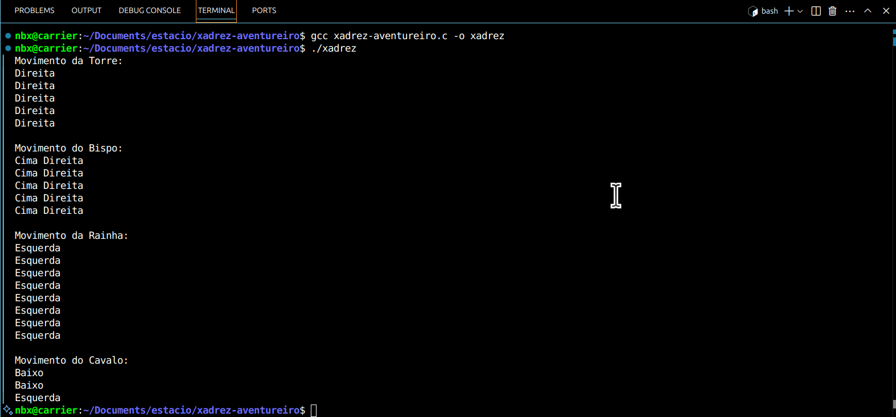

   

[](https://www.gnu.org/licenses/gpl-3.0)

# Simulação de Movimentação de Peças de Xadrez em C ♟️

Este projeto foi desenvolvido como parte do desafio da disciplina de Programação em C, com foco no uso de estruturas de repetição para simular movimentos de peças do jogo de xadrez.

## Universidade Estácio de Sá

Projeto desenvolvido para a disciplina Introdução à Programação de Computadores.
Curso Engenharia de Software.

## 🎯 Objetivo

Simular os movimentos das peças **Torre**, **Bispo**, **Rainha** e **Cavalo**, utilizando diferentes estruturas de repetição (`for`, `while`, `do-while`) e loops aninhados, conforme os níveis **Novato** e **Aventureiro** do desafio.

## 📦 Arquivo

- `xadrez.c`: contém toda a lógica de movimentação das peças, incluindo comentários explicativos.

## 🧠 Peças e Lógica Utilizada

| Peça    | Movimento Simulado                               | Estrutura Usada        |
|---------|--------------------------------------------------|-------------------------|
| Torre   | 5 casas para a direita                           | `for`                  |
| Bispo   | 5 casas na diagonal (cima/direita)               | `while`                |
| Rainha  | 8 casas para a esquerda                          | `do-while`             |
| Cavalo  | 2 casas para baixo e 1 para a esquerda (em "L")  | `for` + `while` aninhado |

### 🧩 Detalhes do Cavalo

- O movimento do Cavalo foi simulado utilizando dois loops aninhados:
  - Um `for` para movimentar **duas casas para baixo**.
  - Um `while` dentro da sequência para movimentar **uma casa para a esquerda**.
- Os movimentos são impressos individualmente com `printf()`.

## 🚀 Como executar

1. Clone o repositório:
   ```bash
   git clone https://github.com/92username/xadrez-aventureiro.git
   cd xadrez-em-c
   ```

2. Compile o código:
   ```bash
   gcc xadrez-aventureiro.c -o xadrez
   ```

3. Execute:
   ```bash
   ./xadrez
   ```

## Output esperado:



## 📚 Aprendizado

Este projeto visa exercitar o uso de estruturas de repetição simples e aninhadas em C.

## 📎 Licença

Projeto acadêmico. Uso livre para fins educacionais.
